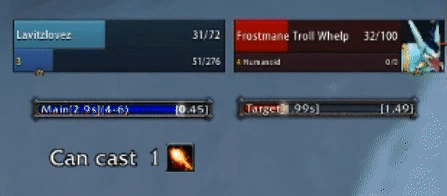
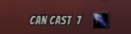
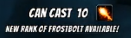
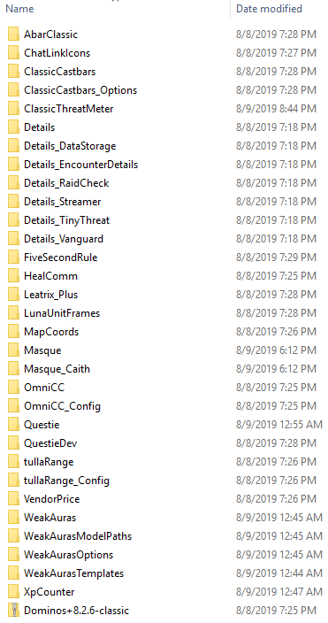

# LavitzFrostboltz (Classic WeakAura)
*Developed by @Lavitz_io*
http://twitter.com/lavitz_io

Version 1.0.3 - Aug 09, 2019

Shows the number of Frostbolts you can currently cast (or Rank 1-3 Fireball when appropriate). It will determine your best spell you can use, and will notify you when you have a new rank available to train. Fireball and Frostbolt alternate being the best until Rank 3 Frostbolt at level 14. Primarily used for leveling efficiently.

Open to feedback and suggestions!

## Helper Addons
The unit frames in the screenshots are Luna Frames. Luna also provides the BANGER font shown in the screenshots.

The black square icon border around spells are removed with the Masque addon.

FiveSecondRule is an addon to show when the mana-per-5-seconds tick after last spell cast will begin. Shown as a blue bar in the gif preview.

Link to my addon pack: htps://github.com/Lavitzio/LavitzFrostboltzWA/blob/master/LavitzAddonzV1.zip

**Wago:** https://wago.io/z4LCSxBR4

## Preview
**GIF** Shows the complete weakaura as of version 1.0.3

- How many spells you can cast with your current mana
- Shows Fireball because that's the best spell available
- Shows when a new rank is available (leveled up in this gif)
- The blue bar under my player frame is FiveSecondRule

**PNG** Shows how many Frostbolts are available to cast.

**PNG** Shows when the next rank is available.

## Files
*LavitzFrostboltzExportString* - String export of this group. Import to use!

*LavitzFrostboltzExportStringLunaBangerFont* - String export with font set to Luna's Banger font.

*LavitzFrostboltzWA.lua* - Displays number of best available spell casts.

*LavitzFrostboltzHelpWA.lua* - Displays latest available spell rank to learn from trainer.

*LavitzFrostboltzIconFrostWA.lua* - Handles displaying the Frostbolt icon.

*LavitzFrostboltzIconFireWA.lua* - Handles displaying the Fireball icon.

*LavitzAddonzV1.zip* - My current pack of addons

Commands for addons:

- /ctm lock|unlock
- /ltp lock|unlock
- /abar lock|unlock
- /details hide|show

*Contents of pack:*

