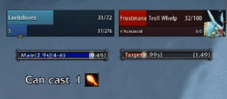
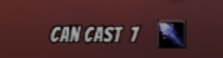
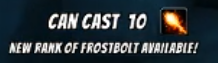
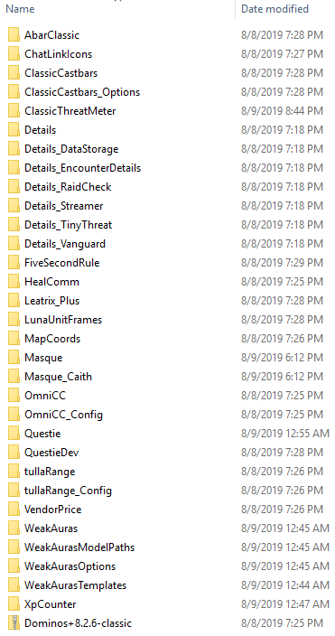

**LavitzFrostboltz (Classic WeakAura)**
*Version 1.1.0 - Aug 11 2019*
*Developed by @Lavitz_io*
http://twitter.com/lavitz_io

Shows the number of Frostbolts you can currently cast (or Rank 1-3 Fireball when appropriate). It will determine your best spell you can use, and will notify you when you have a new rank available to train. Fireball and Frostbolt alternate being the best until Rank 3 Frostbolt at level 14. Developed to be used for leveling more efficiently.

Open to feedback and suggestions! There's a lot of different ways you can place this on your UI!

**Removed the "Can cast" text.** If you want it back, either DM me or edit your Cast Count weakaura under Display > Text Settings > Custom Function, at the very bottom remove the "--" comments before each line

## Helper Addons
The unit frames in the screenshots are Luna Frames. Luna also provides the BANGER font shown in the screenshots.

The black square icon border around spells are removed with the Masque addon.

FiveSecondRule is an addon to show when the mana-per-5-seconds tick after last spell cast will begin. Shown as a blue bar in the gif preview. I also took the Mana Tick weakaura from Buds' UI and put it on my Luna mana bar.

Link to my addon pack: (OLD) https://github.com/Lavitzio/LavitzFrostboltzWA/tree/master/Addons%20and%20Macros

**Wago:** https://wago.io/z4LCSxBR4

## Changelog
- **1.1.0** - Improved icon show logic, removed "Can cast" text, and various bug fixes
- 1.0.8 - Fixed an error with retrieving spell name
- 1.0.6 - Now hides [code]Can cast..[/code] text once you learn Fireball Rank 2

## Preview
**GIF** Shows the complete weakaura as of version 1.0.3

- How many spells you can cast with your current mana
- Shows Fireball because that's the best spell available
- Shows when a new rank is available (leveled up in this gif)
- The blue bar under my player frame is FiveSecondRule

**PNG** Shows how many Frostbolts are available to cast.

**PNG** Shows when the next rank is available.

## Files
*`Import String LavitzFrostboltz`* - Copy and import this string to use!

*Under folder `Code`:*

*`LavitzFrostboltzWA.lua`* - Displays number of best available spell casts.

*`LavitzFrostboltzHelpWA.lua`* - Displays latest available spell rank to learn from trainer.

*`LavitzFrostboltzIconFrostWA.lua`* - Handles displaying the Frostbolt icon.

*`LavitzFrostboltzIconFireWA.lua`* - Handles displaying the Fireball icon.

## Addons and Macros

*`Macros and Addons/README.md`* - List of macros and other weakauras I use

*`Macros and Addons/LavitzAddonzV1.zip`* - My current pack of addons

Does not contain a chat or bag addon. Maybe disable Luna Frames if it's your first time, all of the addons can be overwhelming at first.

Commands for addon anchors on a new character

- /abar lock|unlock
- /ctm lock|unlock
- /ltp lock|unlock
- /details hide|show

*Contents of pack:*

